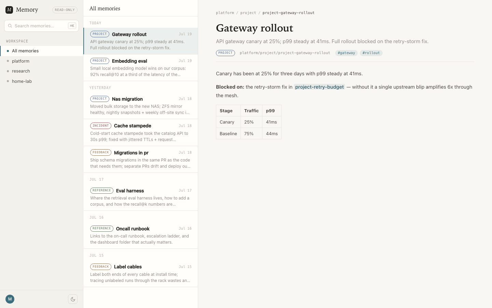
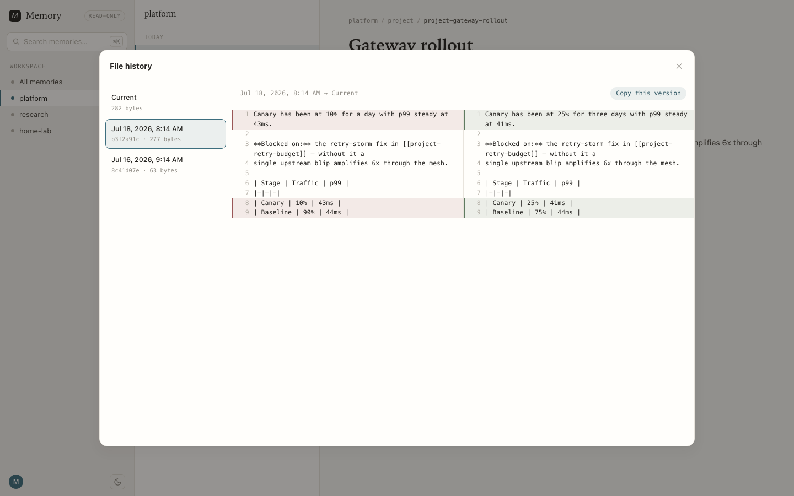

# basic-memory-viewer

A lean, **read-only** web UI for browsing and searching
[basic-memory](https://github.com/basicmachines-co/basic-memory) notes — an
independent, self-hosted viewer inspired by the basic-memory Cloud app. Not
affiliated with or endorsed by Basic Machines.

> [!WARNING]
> **No authentication.** Anyone who can reach this app can read your entire
> knowledge base. Never expose it to the internet — keep it on a private
> network (LAN-only ingress, VPN, or port-forward) or put your own auth proxy
> in front of it.

It is a thin frontend over basic-memory's own MCP tools: it opens a short-lived
MCP session per request and calls `search_notes`, `read_note`,
`recent_activity`, and `list_memory_projects`. There is **no database and no
build step** — nothing to keep in sync. Search is basic-memory's own hybrid
full-text + semantic ranking; the view always reflects the live knowledge base.



## Features

- Three-pane layout: projects · note list · reading pane
- **Semantic search** (delegated to basic-memory's `search_notes`)
- Markdown rendering with `[[wikilink]]` resolution and a "Related" panel
- Card descriptions lazy-hydrate on scroll (batched, TTL-cached)
- **File history**: git-backed note versions with a side-by-side diff dialog,
  plus optional auto-push to a remote for off-site backup (see below)
- Light/dark themes, read-only (no edit/delete affordances)

## Run locally

Point it at a reachable basic-memory MCP endpoint (SSE transport at `/mcp`):

```bash
pip install -r requirements.txt
MCP_URL=http://localhost:8000/mcp uvicorn app.main:app --port 8200
```

No basic-memory around? `MOCK_DATA=1` serves canned demo notes (used for the
screenshot above):

```bash
MOCK_DATA=1 uvicorn app.main:app --port 8200
```

For a cluster-hosted basic-memory, port-forward it first:

```bash
kubectl port-forward -n basic-memory svc/basic-memory 8000:8000
```

## Configuration

| Env | Default | Purpose |
|-|-|-|
| `MCP_URL` | `http://localhost:8000/mcp` | basic-memory MCP SSE endpoint |
| `MOCK_DATA` | _(unset)_ | `1` = serve canned demo notes, no MCP needed |
| `NOTES_DIR` | _(unset)_ | path to the basic-memory notes dir → file history + descriptions served from disk |
| `HISTORY_URL` | _(unset)_ | base URL of a `NOTES_DIR` instance → proxy history to it |
| `SNAPSHOT_INTERVAL` | `300` | seconds between git snapshots (`NOTES_DIR` mode) |
| `GIT_REMOTE` | _(unset)_ | git URL; every snapshot is pushed here for backup |
| `GIT_BRANCH` | `main` | branch used for snapshots/pushes |
| `BM_PROJECT` | `main` | default project shown |
| `APP_TITLE` | `Memory` | brand name shown in the UI |
| `APP_USER` | _(empty)_ | optional account name in the sidebar |

## Container

```bash
docker build -t basic-memory-viewer .
docker run -p 8000:8000 -e MCP_URL=... basic-memory-viewer
```

CI (`.github/workflows/build.yml`) builds and pushes
`ghcr.io/manelpb/basic-memory-viewer` on every push to `main`.

## File history & git backup

Notes are plain markdown files, so history is just git. When the viewer runs
with `NOTES_DIR` pointing at the notes directory, it initializes a git repo
there (`NOTES_DIR/.git`), snapshots changes every `SNAPSHOT_INTERVAL` seconds,
and every note gets a **History** button: version list plus a side-by-side diff
against the current text. Read-only stance preserved — view and copy, no
restore.



Set `GIT_REMOTE` and each snapshot is also pushed — your knowledge base gets an
off-site, full-history backup for free. Use an SSH URL with a mounted deploy
key, or an HTTPS URL carrying a token from a secret. Point it at a **private**
repo.

Deployment shapes:

- **Single instance, same host as basic-memory**: set `NOTES_DIR` on the viewer
  itself. Done.
- **Viewer in a separate pod** (can't mount the notes volume): run a second
  container from this same image next to basic-memory with `NOTES_DIR` (and
  optionally `GIT_REMOTE`), and give the main viewer `HISTORY_URL` pointing at
  it — history requests are proxied through.

Unset both and the feature disappears from the UI.

## Deployment

Runs anywhere a container does — it only needs `MCP_URL` pointing at a reachable
basic-memory MCP endpoint. Deploy it alongside your basic-memory instance (same
network) so it can reach the MCP service directly.

### Helm

`deploy/` holds a Helm chart built on the
[common library chart](https://github.com/manelpb/library-charts). Pin an image
tag (images are tagged by short commit SHA, there is no `latest`), point
`MCP_URL` at your basic-memory service, and install:

```bash
helm dependency build deploy
helm upgrade --install memory-viewer ./deploy \
  -n basic-memory \
  --set image.tag=<short-sha>
```

See `deploy/values.yaml` for the full surface (env, probes, resources,
ingress). Ingress is disabled by default — the viewer has no auth, so keep it
on a private network (LAN-only ingress, VPN, or port-forward).

## Endpoints

| Path | Purpose |
|-|-|
| `/` | index (recent notes for the default project) |
| `/note/{permalink}` | rendered note + related |
| `/search?q=&project=` | search results fragment (semantic) |
| `/descriptions?ids=` | batch note descriptions (lazy card hydration) |
| `/history/{permalink}` | version list for a note (git-backed) |
| `/history-diff/{permalink}?rev=` | side-by-side diff of a revision vs current |
| `/go?to=` | resolve a `[[wikilink]]` target → redirect |
| `/livez` `/healthz` | liveness / readiness (readiness checks MCP) |

## License

[MIT](LICENSE). This project contains no code or assets from basic-memory or
its Cloud app; it only talks to your own basic-memory instance through its
public MCP tools. "basic-memory" is a project of Basic Machines — this viewer
is unaffiliated.
